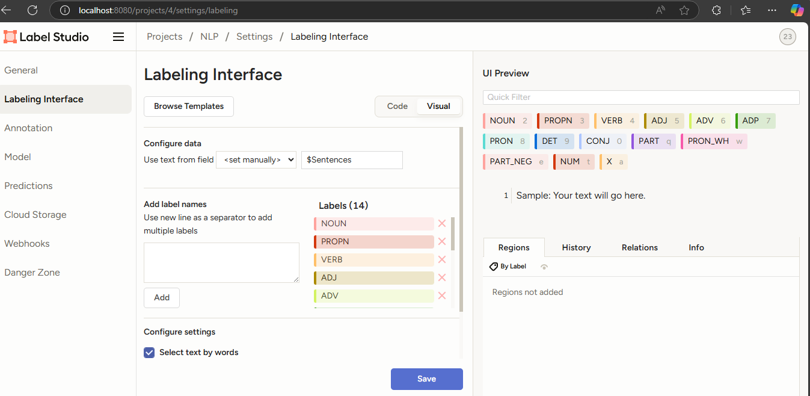

# CS-203_Assignment-3

## Team-20 

1) Chinmay Pendse (23110245)
2) Dakshata Bhamare (23210027)

# Task 1
In this task, we installed python 3.10 from scratch and then we created the virtual environment under which we installed label-studio.
We got several errors like the SSL not founnd; SQLLite not found etc. Which we encountered by installing these on server using the make commands and properly configuring the paths of the python and the other module.

We had to build python everytime we got something new.
The screenshots for the errors and the history file is present in Task_1_screenshots_and_errors.

So please download this pdf where we have discussed all the screenshots, commands and errors.

The image below shows that label-studio was avaiable on our linux server

# Task 2

Here, we used label-studio on our local Windows OS where we annotated our data which was provided.

For the POS part, both the members of our team separate annotations for the provided CSV sentences between 381 to 400 as per our team number. We got the following labels:

Thereafter; we used the LabelStudio to annotate properly and then we exported the files. Thereafter; we just kept the values which are necessary using clean_data.py code such that only the required data while the unncessary part is not kept.

However for the CV dataset we didnt required to clean the data as the options were directly present in the column of choice; so we directly converted the csv files into dataframes and then used our code. We thank Paras Shirvale (@Paras-Shirvale) for helping us to annotate our data as a person from the external team.

## Task 3

In this we used scikit learn library and statmodels library to calulate the Cohen and Fliess Kappa Values

